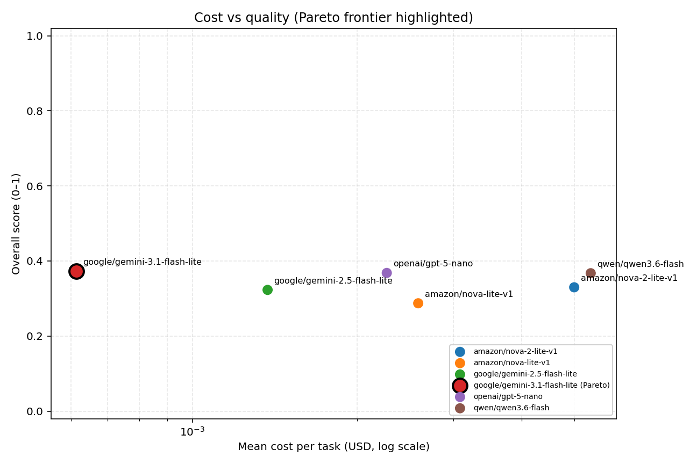
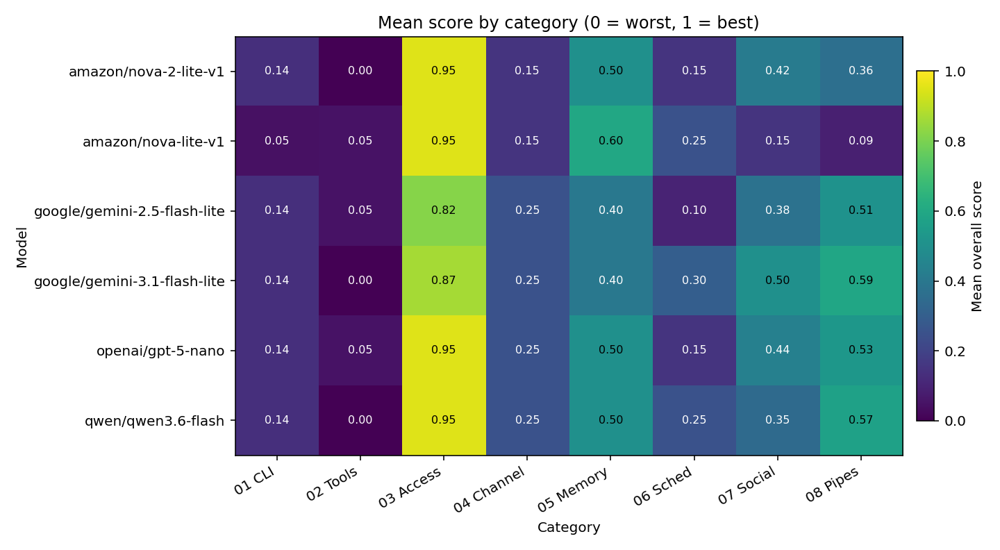

<h1 align="center">HermitBench</h1>

<p align="center">
  
</p>

<p align="center"><em>Cost-vs-performance evaluation for LLMs running inside OpenHermit.</em></p>

---

**HermitBench** is a 60-task benchmark that measures how well LLMs (routed through [OpenRouter](https://openrouter.ai)) can operate an [OpenHermit](https://github.com/HCF-S/openhermit) agent — the open-source agent infrastructure platform with durable Postgres state, multi-channel delivery, fleet management, and a sandboxed workspace.

Unlike CLI-agent benchmarks that test file-and-shell skills in isolation, HermitBench evaluates a model's ability to drive a production-grade agent platform: managing memory across sessions, configuring fleet-wide skills, routing across channels, scheduling cron jobs, and approving sensitive tool calls under an access policy.

## Categories

| # | Category | Focus |
|---|----------|-------|
| 01 | CLI Fluency | `hermit ...` command usage, config, secrets, agent lifecycle |
| 02 | Tool Composition | Multi-tool chains (file + exec + web + memory) |
| 03 | Access Control | Policy rows, approval flow, role-based grants |
| 04 | Channel Routing | Cross-channel session continuity, group routing rules |
| 05 | Memory & Introspection | Long-term memory recall, working memory updates |
| 06 | Scheduling & Automation | Cron jobs, one-shot schedules, run history |
| 07 | Amiko Social | Post drafting, comment voice, AI-twin DMs, feed rank, privacy, group dynamics — Opus-judged for quality |
| 08 | Amiko Pipelines | Personality vibe cards, friend match reports, memory extraction (chat/file), post translation, moderation, twins-take share cards, share copy — Opus-judged for quality |

## Quick Start

```bash
# 1. Build the test image (Ubuntu + Postgres + OpenHermit gateway)
bash script/prepare.sh

# 2. Set OpenRouter API key
echo 'OPENROUTER_API_KEY=sk-or-...' >> .env

# 3. (Optional) Pick a judge model for category 07_Amiko_Social.
#    Tasks in 07 grade prose quality via an LLM-as-judge call to OpenRouter
#    using JUDGE_MODEL (default: anthropic/claude-opus-4.7).
echo 'JUDGE_MODEL=anthropic/claude-opus-4.7' >> .env

# 4. Run all tasks against a model
bash script/run.sh --category all --parallel 4 \
  --model anthropic/claude-sonnet-4.6
```

> Categories 07 and 08 require `OPENROUTER_API_KEY` (for the judge call) and
> read `JUDGE_MODEL` from the environment. Each judge call costs roughly $0.01
> with `anthropic/claude-opus-4.7`; if you want to bench-test on the cheap,
> set `JUDGE_MODEL=anthropic/claude-haiku-4.7` or similar.

Per-task results land under `output/<category>/<task_id>/<model_timestamp_runid>/` with `score.json`, `usage.json`, `gateway.log`, and the seeded Postgres dump.

<!-- BENCH:START -->
## Results — first cheap-tier sweep (2026-05-16)

Six multimodal "lite/nano/flash" models, 79 tasks each, all routed through OpenRouter. Categories 07 + 08 graded by `anthropic/claude-opus-4.7` as judge. `meta-llama/llama-4-maverick` was excluded post-hoc because OpenRouter returned `No endpoints found that support tool use` on every task; raw summary kept under `output/_excluded/`.

| Rank | Model | Overall Score | Mean Time | Mean Cost/Task | Total Cost (79 tasks) |
| ---: | :---- | ------------: | --------: | -------------: | --------------------: |
| 1 | `google/gemini-3.1-flash-lite` | **37.3%** | 14.7s | $0.0006 | **$0.049** |
| 2 | `openai/gpt-5-nano` | 36.8% | 1m 1s | $0.0023 | $0.179 |
| 3 | `qwen/qwen3.6-flash` | 36.7% | 8.4s | $0.0054 | $0.423 |
| 4 | `amazon/nova-2-lite-v1` | 33.0% | 1m 1s | $0.0050 | $0.394 |
| 5 | `google/gemini-2.5-flash-lite` | 32.3% | 15.7s | $0.0014 | $0.108 |
| 6 | `amazon/nova-lite-v1` | 28.7% | 14.6s | $0.0026 | $0.204 |

> `gemini-3.1-flash-lite` cost is derived from token counts × OpenRouter's listed pricing ($0.25/M input, $1.5/M output) — OpenRouter doesn't return a `cost` field for this model in its chat-completions response, but token counts are present and the math is deterministic.
> Tasks where the agent or grader errored count as overall_score=0.0: nova-2-lite-v1 (7), gemini-2.5-flash-lite (9), gemini-3.1-flash-lite (3), gpt-5-nano (3), nova-lite-v1 (2).







**Takeaway:** at the cheap-multimodal tier, **`google/gemini-3.1-flash-lite` is the Pareto winner** — highest score (37.3%) at the lowest cost ($0.049 for the full 79-task sweep, ~3.7× cheaper than `gpt-5-nano` and ~8.7× cheaper than `qwen3.6-flash`). `gpt-5-nano` and `qwen3.6-flash` are statistically tied at ~37% but cost noticeably more per task. All six models struggle on `02_Tool_Composition` (multi-step tool chains) and excel on `03_Access_Control` (one-shot refusal patterns) — the heatmap shows the spread clearly.

Regenerate everything with `python3 script/report.py` after any new sweep.
<!-- BENCH:END -->

## How it works

Each task runs in its own Docker container that boots Postgres and an OpenHermit gateway. A per-task `seed.sql` plus workspace files establish a starting agent state. The runner sets `model.provider=openrouter` and `model.model=<args.model>`, then sends the task prompt to the agent via the OpenHermit SDK. After the agent exits (or times out), a grader Python function queries the Postgres state and the filesystem to compute scores. Token usage and cost are extracted from gateway logs.

## Acknowledgements

HermitBench's harness — Dockerized per-task containers, markdown task format with embedded graders, OpenRouter-driven cost-vs-performance reporting — is derived from [WildClawBench](https://github.com/InternLM/WildClawBench), which benchmarks the same kind of evaluation against [OpenClaw](https://github.com/openclaw/openclaw). If you use HermitBench in research, please also cite the upstream work:

```bibtex
@article{ding2026wildclawbench,
  title={WildClawBench: A Benchmark for Real-World, Long-Horizon Agent Evaluation},
  author={Ding, Shuangrui and Dai, Xuanlang and Xing, Long and Ding, Shengyuan and Liu, Ziyu and JingYi, Yang and Yang, Penghui and Zhang, Zhixiong and Wei, Xilin and Fang, Xinyu and others},
  journal={arXiv preprint arXiv:2605.10912},
  year={2026}
}
```

For machine-readable HermitBench citation metadata see [`CITATION.cff`](CITATION.cff) — GitHub will use this file to populate the repository's "Cite this repository" panel.

## License

MIT.
