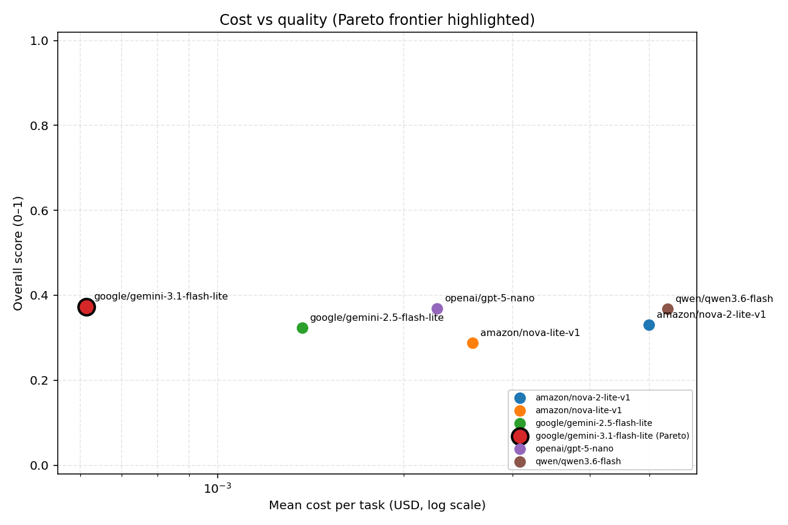
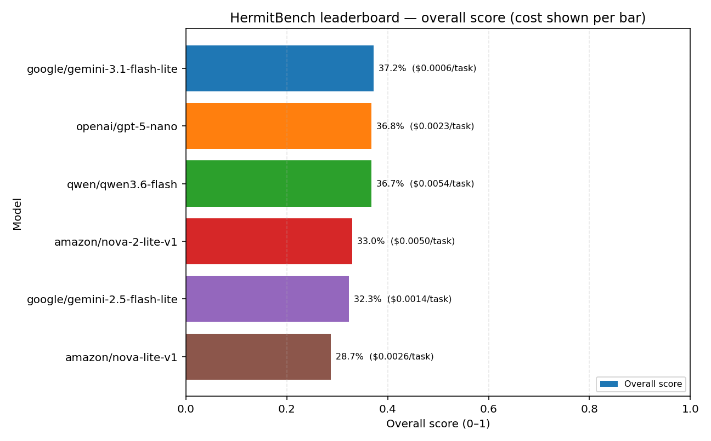
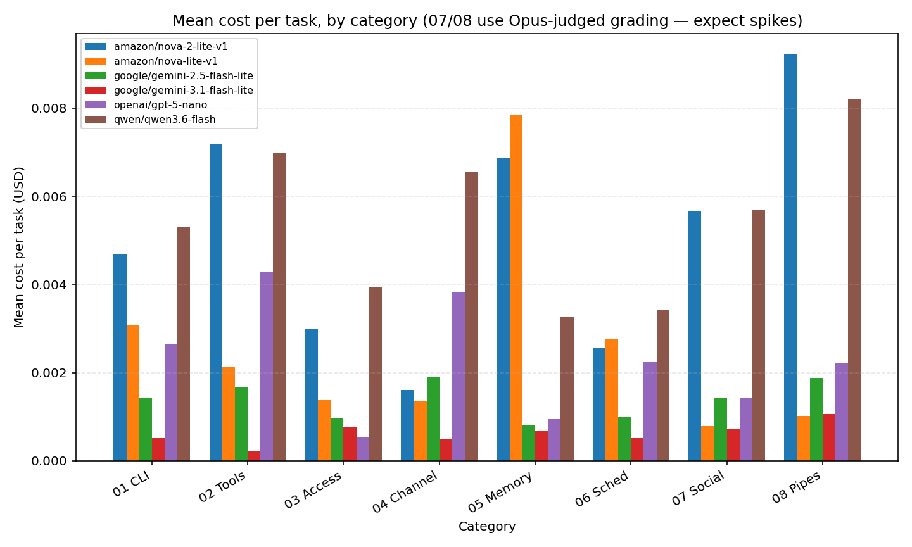

## Model Leaderboard

_Generated: 2026-05-16 11:56 UTC_

| Rank | Model | Overall Score | Mean Time | Mean Cost/Task | Total Cost (79 tasks) |
| ---: | :---- | ------------: | --------: | -------------: | --------------------: |
| 1 | `google/gemini-3.1-flash-lite` | **37.2%** | 35.0s | $0.0006 | $0.048 |
| 2 | `openai/gpt-5-nano` | 36.8% | 1m 1s | $0.0023 | $0.179 |
| 3 | `qwen/qwen3.6-flash` | 36.7% | 8.4s | $0.0054 | $0.423 |
| 4 | `amazon/nova-2-lite-v1` | 33.0% | 1m 1s | $0.0050 | $0.394 |
| 5 | `google/gemini-2.5-flash-lite` | 32.3% | 15.7s | $0.0014 | $0.108 |
| 6 | `amazon/nova-lite-v1` | 28.7% | 14.6s | $0.0026 | $0.204 |

> Tasks with agent/grading errors counted as 0.0 overall_score: `amazon/nova-2-lite-v1` (7), `amazon/nova-lite-v1` (2), `google/gemini-2.5-flash-lite` (9), `google/gemini-3.1-flash-lite` (3), `openai/gpt-5-nano` (3).

### Charts

